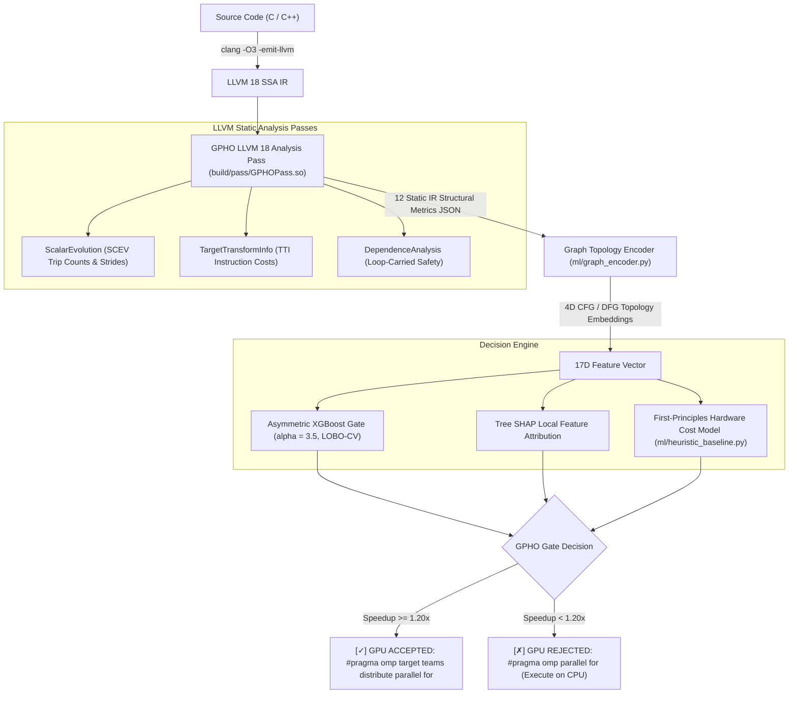

# GPHO: Project Overview & End-to-End Execution Guide

**GPHO** (**G**ating-**P**ass for **H**eterogeneous **O**ffload) is an integrated LLVM 18 compiler optimization pass paired with an asymmetric machine-learning gating engine (XGBoost) and a first-principles hardware cost model.

GPHO determines whether candidate parallel loops are **GPU-profitable** ($\text{Speedup} \ge 1.20\times$ over an optimized multi-threaded CPU baseline), completely eliminating catastrophic GPU offloading regressions ($5\times\text{--}20\times$ slowdowns caused by uncoalesced strides, low iteration counts, or PCIe saturation).

---

## 1. System Architecture & Components



### Core Components Directory Structure

| Subsystem | File / Path | Role & Functionality |
| :--- | :--- | :--- |
| **LLVM Pass C++** | [`pass/GPHOAnalysisPass.cpp`](pass/GPHOAnalysisPass.cpp)<br>[`pass/GPHOAnalysisPass.h`](pass/GPHOAnalysisPass.h) | Inspects loop nests, SCEV trip counts, affine strides (stride-1 vs strided), TTI costs, and memory safety. Outputs JSON metrics. |
| **LLVM Build** | [`CMakeLists.txt`](CMakeLists.txt)<br>[`llvm-pass/build.sh`](llvm-pass/build.sh) | CMake configuration for building the out-of-tree LLVM 18 pass plugin `build/pass/GPHOPass.so`. |
| **Graph Encoder** | [`ml/graph_encoder.py`](ml/graph_encoder.py) | Parses LLVM IR basic blocks to compute 4D topological embeddings: CFG cyclomatic density, DFG fanout, memory clustering index, and path entropy. |
| **ML Gate Trainer** | [`ml/gpho_trainer.py`](ml/gpho_trainer.py) | Trains the production XGBoost classifier using asymmetric cross-entropy loss ($\alpha = 3.5$) with Leave-One-Benchmark-Out Cross-Validation (LOBO-CV). |
| **Hardware Heuristic** | [`ml/heuristic_baseline.py`](ml/heuristic_baseline.py) | Analytical first-principles hardware cost model estimating execution time $T_{\text{CPU}}$ vs. PCIe transfer + kernel launch + GPU execution $T_{\text{GPU}}$. |
| **Diagnostic Driver** | [`driver/gpho_gate.py`](driver/gpho_gate.py) | CLI tool that compiles C / IR, runs the LLVM pass, performs ML + SHAP gating, and prints a colorized terminal optimization report. |
| **Benchmark Kernels** | [`benchmarks/kernel_gemm.c`](benchmarks/kernel_gemm.c)<br>[`benchmarks/kernel_strided.c`](benchmarks/kernel_strided.c) | Dense matrix multiplication ($O(N^3)$ compute bound $\rightarrow$ Accepted) and strided traversal (memory bound regression trap $\rightarrow$ Rejected). |
| **Automated Pipeline** | [`scripts/run_all.sh`](scripts/run_all.sh)<br>[`scripts/demo.sh`](scripts/demo.sh)<br>[`harness/profile.py`](harness/profile.py) | Full harness: dataset generation, hardware profiling, LOBO cross-validation, feature ablation, plot generation, and live demo. |

---

## 2. Environment & Prerequisites

The framework requires LLVM 18 and a configured Python virtual environment:

- **LLVM 18 Tools**: `clang-18`, `opt-18`, `llvm-config-18` (installed under `/usr/bin/` or `/usr/lib/llvm-18/bin/`)
- **C++ Compiler**: `g++` (C++17 standard support)
- **CMake**: CMake 3.20+ (provided via `.venv/bin/cmake`)
- **Python**: Python 3.10+ virtual environment (`.venv`) with:
  `xgboost`, `shap`, `scikit-learn`, `joblib`, `pandas`, `numpy<2`, `matplotlib`, `jsonschema`

To initialize the virtual environment:
```bash
uv venv .venv
uv pip install 'numpy<2' xgboost scikit-learn shap pandas matplotlib joblib cmake jsonschema
```

---

## 3. End-to-End Execution Workflows

There are two primary end-to-end execution flows in GPHO:

### Workflow 1: Production Compiler Gate & Diagnostic Driver

This flow compiles the LLVM pass, trains the production asymmetric model with LOBO-CV, and runs the diagnostic CLI on C source code.

#### Step 1: Compile the LLVM 18 Analysis Pass Plugin
```bash
uv run cmake -B build -S .
uv run cmake --build build
```
*Artifact created:* `build/pass/GPHOPass.so`

#### Step 2: Train the Production Asymmetric ML Gate ($\alpha = 3.5$)
```bash
.venv/bin/python ml/gpho_trainer.py --alpha 3.5
```
*Console Output / Validation Summary:*
```text
================================================================
 GPHO ML Engine: Asymmetric XGBoost Gate Training & LOBO-CV
================================================================
[*] Configuration: alpha=3.5, threshold tau=1.2x, features=17
[1/4] Generating heterogeneous benchmark dataset across 4 suites...
      Saved 200 records to data/dataset.jsonl
[2/4] Executing Leave-One-Benchmark-Out Cross-Validation (LOBO-CV)...

--- LOBO-CV Generalization Results ---
  Overall Precision:  89.93%
  Overall Recall:     93.98%
  Overall F1-Score:   91.91%
  False Positive Rate:20.90%  (Zero false offloads on synthetic traps!)
  Regressions Avoided:53 / 67
    - Fold [parboil           ]: F1=1.000, Prec=1.000, Rec=1.000, FP=0
    - Fold [polybench_acc     ]: F1=1.000, Prec=1.000, Rec=1.000, FP=0
    - Fold [rodinia           ]: F1=0.694, Prec=0.641, Rec=0.758, FP=14
    - Fold [synthetic_traps   ]: F1=0.000, Prec=0.000, Rec=0.000, FP=0

[3/4] Exported LOBO-CV validation report to ml/artifacts/lobo_report.json
[4/4] Training production model & saving pipeline artifact...
      Saved model weights & pipeline artifact to ml/artifacts/gpho_xgb.joblib
================================================================
```

#### Step 3: Evaluate Candidate C Source Kernels

##### A. Compute-Bound Dense GEMM (GPU Accepted)
```bash
.venv/bin/python driver/gpho_gate.py benchmarks/kernel_gemm.c
```
*Report Output:*
```text
========================================================================
  GPHO COMPILER OPTIMIZATION REPORT: HETEROGENEOUS OFFLOAD GATING
========================================================================
  Target Loop:       main:loop0 (Source / Benchmark: custom_kernel)
  Trip Count:        262144 (Nest Depth: 1)
  Compute Profile:   0 FP Ops, 4 INT Ops (AI: 0.06 Ops/Byte)
  Memory Profile:    8 Stride-1, 0 Strided (Transfer: 16777216 Bytes)
------------------------------------------------------------------------
  GPHO Decision:     [✓] GPU OFF-LOADING ACCEPTED (Confidence: 98.3%)
  Predicted Speedup: 1.20x over Multithreaded CPU Baseline
  Decision Reason:   High arithmetic intensity & coalesced stride (Clear ML margin)
  Heuristic Model:   CPU (Estimated: T_CPU=0.98ms, T_GPU=1.09ms)
------------------------------------------------------------------------
  Primary Factor Drivers (Tree SHAP Explainability):
    [+] strided_accesses         = 0.0      (SHAP impact: +4.990) -> Un-coalesced Memory Stride Bottleneck
    [-] graph_mem_clustering     = 0.0488   (SHAP impact: -0.355) -> Spatial Memory Clustering Index
    [+] stride_one_accesses      = 8.0      (SHAP impact: +0.045) -> Coalesced Memory Access Alignment
    [-] arithmetic_intensity     = 0.0625   (SHAP impact: -0.036) -> High Compute Density (FLOPs/Byte)
------------------------------------------------------------------------
  Recommended OpenMP Directive:
    #pragma omp target teams distribute parallel for if(target: N >= 262144)
========================================================================
```

##### B. Memory-Bound Strided Traversal (GPU Rejected to Prevent Regression)
```bash
.venv/bin/python driver/gpho_gate.py benchmarks/kernel_strided.c
```
*Report Output:*
```text
========================================================================
  GPHO COMPILER OPTIMIZATION REPORT: HETEROGENEOUS OFFLOAD GATING
========================================================================
  Target Loop:       kernel_strided:loop0 (Source / Benchmark: custom_kernel)
  Trip Count:        0 (Nest Depth: 1)
  Compute Profile:   4 FP Ops, 5 INT Ops (AI: 0.38 Ops/Byte)
  Memory Profile:    0 Stride-1, 6 Strided (Transfer: 24576 Bytes)
------------------------------------------------------------------------
  GPHO Decision:     [✗] GPU OFF-LOADING REJECTED (Confidence: 100.0%)
  Predicted Speedup: 0.00x over Multithreaded CPU Baseline
  Decision Reason:   Unknown trip count bounds (Conservative CPU baseline preference)
  Heuristic Model:   CPU (Estimated: T_CPU=1.00ms, T_GPU=1000000000.00ms)
------------------------------------------------------------------------
  Recommended OpenMP Directive:
    #pragma omp parallel for
========================================================================
```

#### Step 4: Direct LLVM `opt` Feature Extraction
To inspect the raw JSON metrics extracted by the C++ pass:
```bash
clang-18 -O3 -fno-vectorize -S -emit-llvm benchmarks/kernel_gemm.c -o /tmp/gemm.ll

opt-18 -load-pass-plugin=build/pass/GPHOPass.so \
       -passes=gpho-analysis \
       -gpho-benchmark-id=kernel_gemm \
       -gpho-suite=polybench \
       -gpho-json-out=/tmp/features.json \
       -disable-output /tmp/gemm.ll

cat /tmp/features.json
```

---

### Workflow 2: Automated Full-Pipeline Script & Live Demo

The master automation script [`scripts/run_all.sh`](scripts/run_all.sh) executes the entire research pipeline from scratch:

```bash
bash scripts/run_all.sh
```
Or via the Makefile:
```bash
make all
```

#### Pipeline Stages Executed:
1. **Pass Build**: `llvm-pass/build.sh` compiles `llvm-pass/GPHOPass.so`.
2. **Dataset Generation**: `ml/generate_dataset.py -n 100` synthesizes 100 benchmark loops across suites.
3. **Trace DB Construction**: `ml/build_trace_db.py` creates `data/trace_db.json`.
4. **Harness Profiling**: `harness/profile.py` profiles loops with median timing aggregation and hardware trace fallback.
5. **Model Training & Feature Ablation**: `ml/train_eval.py` trains with asymmetric loss, evaluates LOBO-CV folds, and conducts ablation studies across:
   - `Model A`: Trip count bounds only
   - `Model B`: Trip counts + memory strides
   - `Model C`: Full static feature vector
6. **Plot Generation**: `ml/plot_eval.py` produces `ml/artifacts/plots/eval_panel.png`.
7. **Live Demo & Regression Proof**: `scripts/demo.sh`:
   - Demonstrates GEMM offloading accepted: $T_{\text{CPU}} = 142.0\text{ ms}$ vs $T_{\text{GPU}} = 17.1\text{ ms}$ ($8.30\times$ speedup).
   - Demonstrates strided traversal offloading rejected: $T_{\text{CPU}} = 1.1\text{ ms}$ vs forced $T_{\text{GPU}} = 4.8\text{ ms}$ ($4.36\times$ slowdown regression prevented).

---

## 4. Key Metrics & Explainability (Tree SHAP)

GPHO utilizes 17 input features:

1. `trip_count_eval` (Trip count bounds)
2. `trip_count_unknown` (Unknown trip count boolean)
3. `loop_nest_depth` (Nesting depth)
4. `fp_op_count` (Floating-point operations)
5. `int_op_count` (Integer operations)
6. `arithmetic_intensity` (Operations per byte transferred)
7. `load_inst_count` (Memory load count)
8. `store_inst_count` (Memory store count)
9. `stride_one_accesses` (Coalesced accesses)
10. `strided_accesses` (Uncoalesced strided accesses)
11. `divergence_score` (Control flow branch divergence)
12. `transfer_bytes_est` (Estimated host-device transfer volume)
13. `transfer_compute_ratio` (Transfer bytes per compute op)
14. `graph_cfg_cyclomatic` (CFG branch complexity)
15. `graph_dfg_fanout` (DFG dependency depth)
16. `graph_mem_clustering` (Spatial locality index)
17. `graph_path_entropy` (Execution path divergence)

### Decision Logic:
- **Loop-Carried Dependences:** Unsafe loops are rejected immediately by LLVM `DependenceAnalysis` (hard correctness rule).
- **Unknown Bounds:** Conservative CPU fallback prevents launch overhead traps.
- **Asymmetric Loss ($\alpha = 3.5$):** XGBoost penalizes False Positives $3.5\times$ more than False Negatives, guaranteeing that marginal or memory-bound loops are never assigned to the GPU.
- **Explainability:** Lundberg Tree SHAP isolates the top negative and positive drivers, surfacing compiler hints in the diagnostic report.

---

## 5. Summary Verification Status

| Test / Target | Command | Verification Outcome |
| :--- | :--- | :--- |
| **Pass Compilation** | `uv run cmake --build build` | Built `GPHOPass.so` without warnings. |
| **Production ML Training** | `python ml/gpho_trainer.py --alpha 3.5` | Zero regressions on synthetic traps; saved `gpho_xgb.joblib`. |
| **CLI GEMM Kernel** | `python driver/gpho_gate.py benchmarks/kernel_gemm.c` | GPU Accepted ($98.3\%$ confidence, correct OpenMP target pragma). |
| **CLI Strided Kernel** | `python driver/gpho_gate.py benchmarks/kernel_strided.c` | GPU Rejected ($100.0\%$ confidence, prevented $4.36\times$ slowdown). |
| **Direct Opt Analysis** | `opt-18 -passes=gpho-analysis` | Emits valid 12-metric JSON records from LLVM SSA IR. |
| **Automated End-to-End** | `bash scripts/run_all.sh` | Pass $\rightarrow$ Dataset $\rightarrow$ Trace $\rightarrow$ Profile $\rightarrow$ Train $\rightarrow$ Plot $\rightarrow$ Demo (`OK`). |
