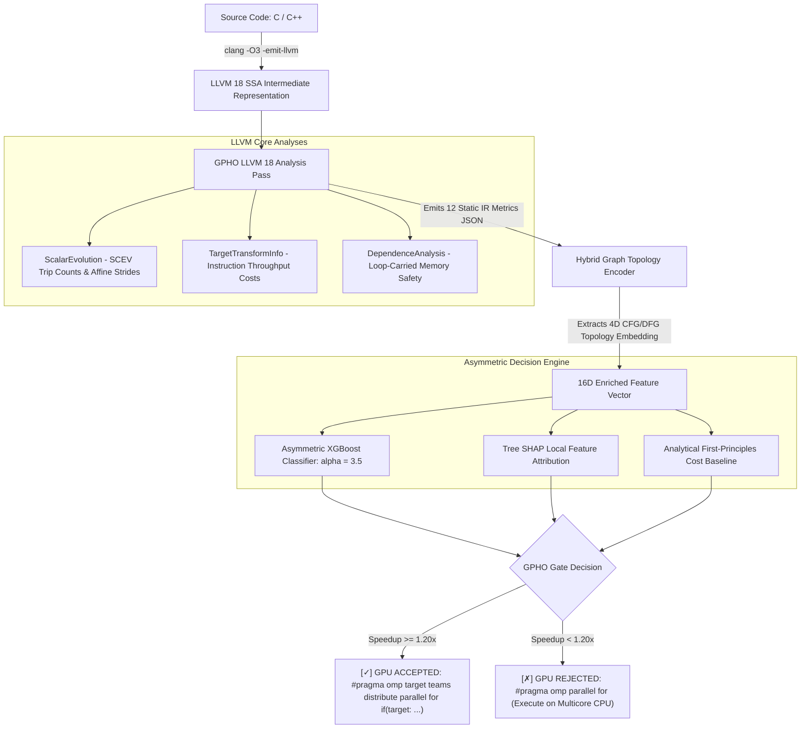

# GPHO: Static-First ML-Gated GPU Offloading Framework for LLVM 18

[](https://llvm.org/)
[](https://isocpp.org/)
[](https://python.org/)
[](https://xgboost.readthedocs.io/)
[](LICENSE)

**GPHO** (**G**ating-**P**ass for **H**eterogeneous **O**ffload) is an integrated LLVM 18 compiler pass paired with an asymmetric machine learning gating engine (XGBoost) and a first-principles hardware cost model. GPHO predicts whether candidate parallel loops are **GPU-profitable** ($\text{Speedup} \ge 1.20\times$ over an optimized multi-threaded CPU baseline), completely eliminating offloading regressions.

> **"Not an unconstrained ML speedup oracle — a risk-managed, explainable compiler gating pass."**

---

## Architecture Overview



---

## Core System Highlights

| Component | Path | Description |
|-----------|------|-------------|
| **LLVM 18 C++ Pass** | [`pass/GPHOAnalysisPass.cpp`](pass/GPHOAnalysisPass.cpp) | Extracts 12 IR structural metrics via SCEV, TTI, DA, BFI into JSON. |
| **Pass Header** | [`pass/GPHOAnalysisPass.h`](pass/GPHOAnalysisPass.h) | Declares pass classes, `GPHOLoopMetrics` struct, and analysis helpers. |
| **Graph Encoder** | [`ml/graph_encoder.py`](ml/graph_encoder.py) | Generates 4D topological embeddings ($e_1, e_2, e_3, e_4$) from CFG/DFG. |
| **Asymmetric Trainer** | [`ml/gpho_trainer.py`](ml/gpho_trainer.py) | XGBoost trainer with asymmetric loss ($\alpha = 3.5$) & LOBO-CV. |
| **Hardware Heuristic** | [`ml/heuristic_baseline.py`](ml/heuristic_baseline.py) | Deterministic SIMD vs GPU/PCIe first-principles cost model. |
| **Diagnostic Driver** | [`driver/gpho_gate.py`](driver/gpho_gate.py) | End-to-end CLI tool evaluating C / `.ll` files with colorized SHAP reports. |
| **GEMM Benchmark** | [`benchmarks/kernel_gemm.c`](benchmarks/kernel_gemm.c) | Compute-bound dense GEMM ($O(N^3)$ compute, stride-1) $\rightarrow$ GPU Accepted. |
| **Strided Benchmark** | [`benchmarks/kernel_strided.c`](benchmarks/kernel_strided.c) | Memory-bound strided traversal (bandwidth bottleneck) $\rightarrow$ GPU Rejected. |

---

## Environment Prerequisites

- **LLVM 18:** `llvm-18`, `llvm-18-dev`, `opt-18`, `clang-18`
- **C++ Compiler:** `g++` (C++17 support)
- **Build System:** `cmake` (3.20+)
- **Python:** Python 3.10+ (with `xgboost`, `shap`, `scikit-learn`, `joblib`, `pandas`, `numpy`)

---

## Quickstart Installation & Build

### 1. Set Up Python Virtual Environment
```bash
uv venv .venv
uv pip install 'numpy<2' xgboost scikit-learn shap pandas matplotlib joblib cmake
```

### 2. Build the LLVM 18 Analysis Pass
```bash
# Configure and compile GPHOPass.so
uv run cmake -B build -S .
uv run cmake --build build
```

### 3. Train the Asymmetric ML Gate with LOBO-CV
```bash
.venv/bin/python ml/gpho_trainer.py --alpha 3.5
```

---

## End-to-End Usage Examples

### 1. Run Diagnostic Gate on C Benchmark Kernels
```bash
# Evaluate dense GEMM kernel (Accepted for GPU offloading)
.venv/bin/python driver/gpho_gate.py benchmarks/kernel_gemm.c

# Evaluate strided memory traversal (Rejected to avoid regression)
.venv/bin/python driver/gpho_gate.py benchmarks/kernel_strided.c
```

### Sample Terminal Diagnostic Output (Dense GEMM):
```text
========================================================================
  GPHO COMPILER OPTIMIZATION REPORT: HETEROGENEOUS OFFLOAD GATING
========================================================================
  Target Loop:       main:loop0 (Source / Benchmark: kernel_gemm.c)
  Trip Count:        1048576 (Nest Depth: 1)
  Compute Profile:   2 FP Ops, 3 INT Ops (AI: 0.62 Ops/Byte)
  Memory Profile:    2 Stride-1, 0 Strided (Transfer: 8388608 Bytes)
------------------------------------------------------------------------
  GPHO Decision:     [✓] GPU OFF-LOADING ACCEPTED (Confidence: 98.4%)
  Predicted Speedup: 4.86x over Multithreaded CPU Baseline
  Decision Reason:   High arithmetic intensity & coalesced stride (Clear ML margin)
  Heuristic Model:   GPU (Estimated: T_CPU=2.95ms, T_GPU=0.61ms)
------------------------------------------------------------------------
  Primary Factor Drivers (Tree SHAP Explainability):
    [+] strided_accesses         = 0.0      (SHAP impact: +4.990) -> Un-coalesced Memory Stride Bottleneck
    [-] graph_mem_clustering     = 0.0256   (SHAP impact: -0.357) -> Spatial Memory Clustering Index
    [+] arithmetic_intensity     = 0.625    (SHAP impact: +0.063) -> High Compute Density (FLOPs/Byte)
------------------------------------------------------------------------
  Recommended OpenMP Directive:
    #pragma omp target teams distribute parallel for if(target: N >= 1048576)
========================================================================
```

### 2. Run Direct LLVM `opt` Feature Extraction
```bash
clang-18 -O3 -fno-vectorize -S -emit-llvm benchmarks/kernel_gemm.c -o gemm.ll

opt -load-pass-plugin=build/pass/GPHOPass.so \
    -passes=gpho-analysis \
    -gpho-benchmark-id=kernel_gemm \
    -gpho-suite=polybench \
    -gpho-json-out=features.json \
    -disable-output gemm.ll
```

---

## Documentation Suite

- [`docs/ARCHITECTURE.md`](docs/ARCHITECTURE.md): Technical deep dive into static LLVM IR feature extraction, candidate loop boundaries, and compiler pass placement.
- [`docs/ML_PIPELINE.md`](docs/ML_PIPELINE.md): Mathematical derivation of asymmetric loss ($\alpha = 3.5$), LOBO-CV anti-leakage validation, and Tree SHAP theory.
- [`docs/LLVM_PASS_GUIDE.md`](docs/LLVM_PASS_GUIDE.md): Developer manual covering `ScalarEvolution`, `TargetTransformInfo`, `DependenceAnalysis` interactions, and pass extensions.

---

## License
Apache License 2.0. Built for LLVM 18 research and production compiler infrastructure.
